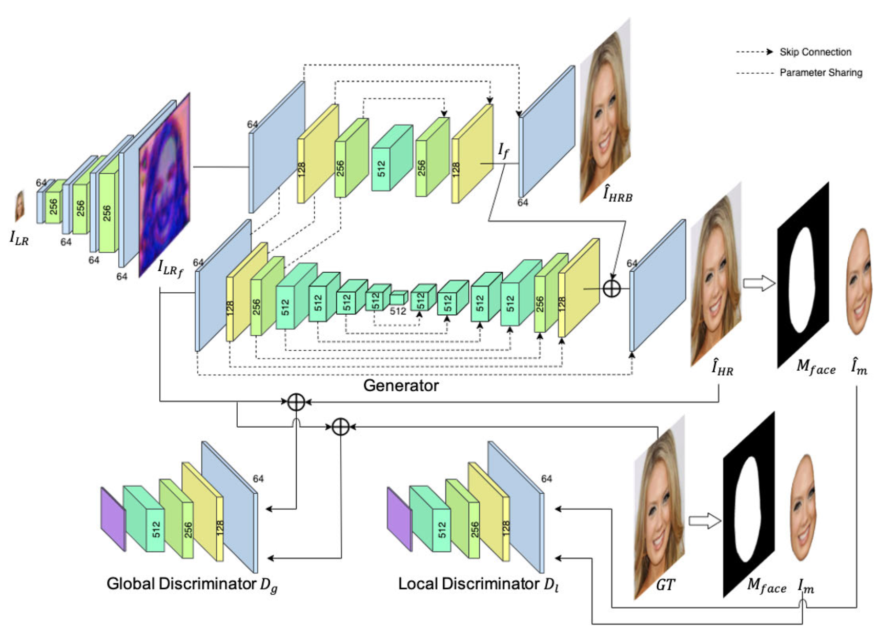
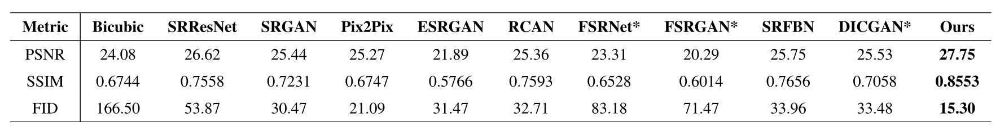
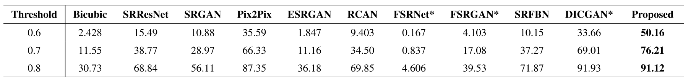

# Face_SRnDeblur
Face SR and Deblur using GAN based network.

Code for this paper [Joint Face Super-Resolution and Deblurring Using Generative Adversarial Network](https://ieeexplore.ieee.org/abstract/document/9181507)

Jung Un Yun, Byungho Jo, In Kyu Park.

In IEEE Access.

## Introduction
FaceSRnDeblur based on generative adversarial network. We first increase the spatial resolution of the LR facial image by 8 times using 5-layer CNN. Then, the encoder extracts the features of the up-scaled image. Those features are sent to two branches which are the decoders to generate an HR facial image with and without blur. In addition, we combine local and global discriminators to focus mon reconstructing HR facial structures. Furthermore, the proposed network can be used to generate diverse HR facial images from blurred LR facial images by adding Gaussian random noise to after every convolution layer.

## Results on Synthetic Datasets

## Results on Real Data from YouTube

## Comparison Results with SOTA

## Comparison of Noise Effect

## Landmark Detection Results

## Parsing Map Estimation Results

## Quantitative Comparison Results

## Accuracy of Face Recognition

## Prerequisites
* Python 3.5
* Pytorch
* OpenCV
